Job Board Backend API Documentation

Table of Contents
-----------------

*   [Authentication Routes](#authentication-routes)
*   [Job Listings Routes](#job-listings-routes)
*   [Rate Limiting](#rate-limiting)
*   [Authentication](#authentication)
*   [Security](#security)
*   [Technologies Used](#technologies-used)
*   [Contributing](#contributing)
*   [License](#license)

*   # MERN Stack Job Application

Bu repo, MERN (MongoDB, Express.js, React, Node.js) yığını ile geliştirilmiş bir iş başvuru uygulamasını içerir.

## Ekran Görüntüleri

- 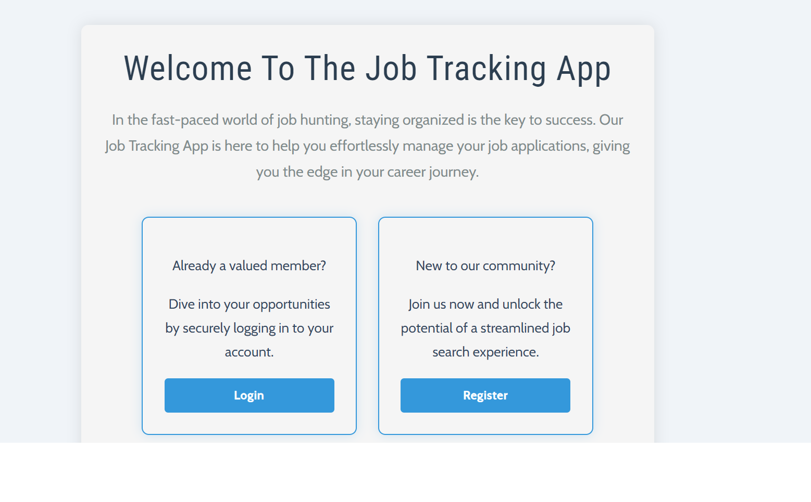
- 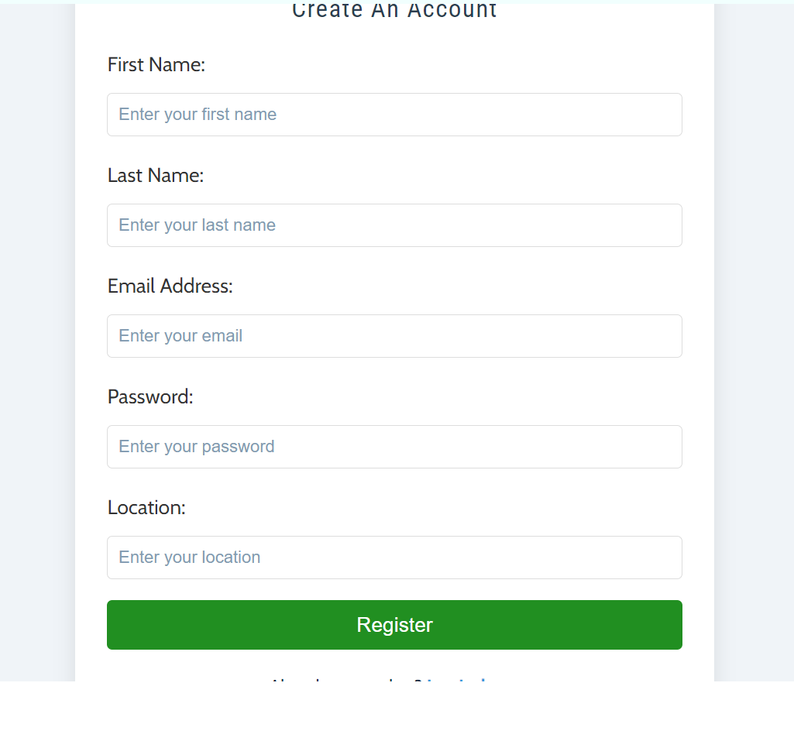
- 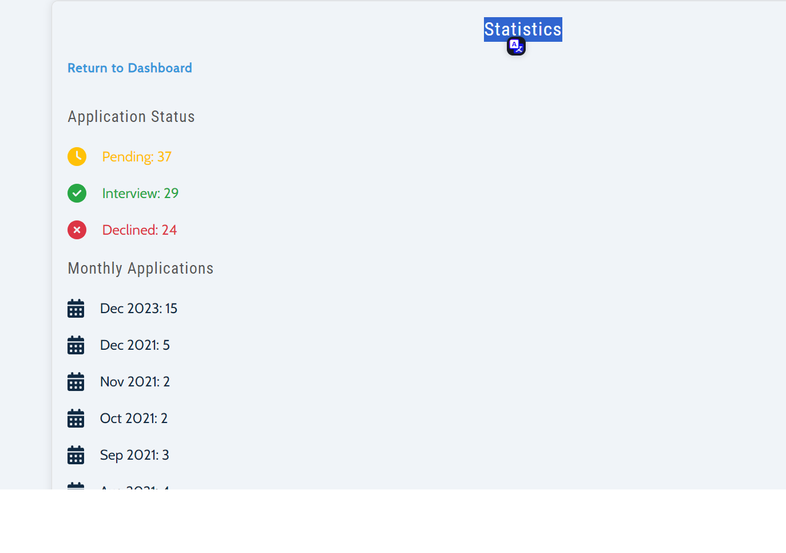
- 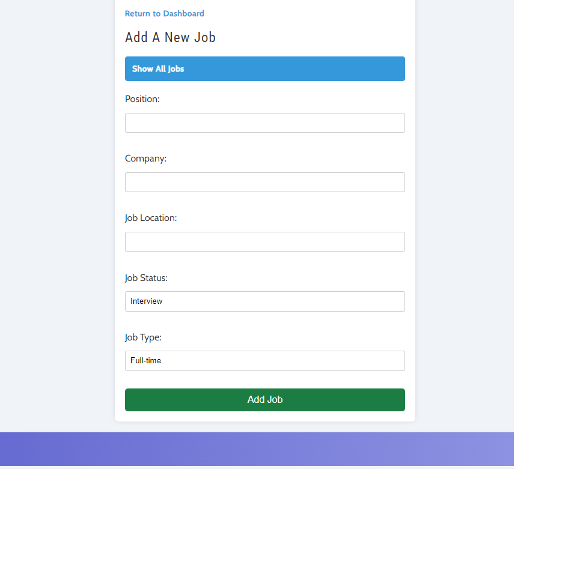
- 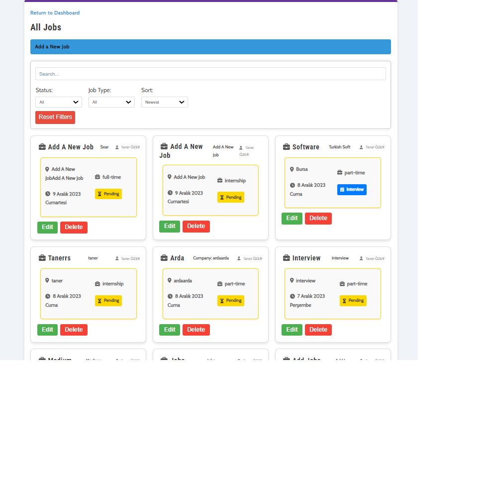
- 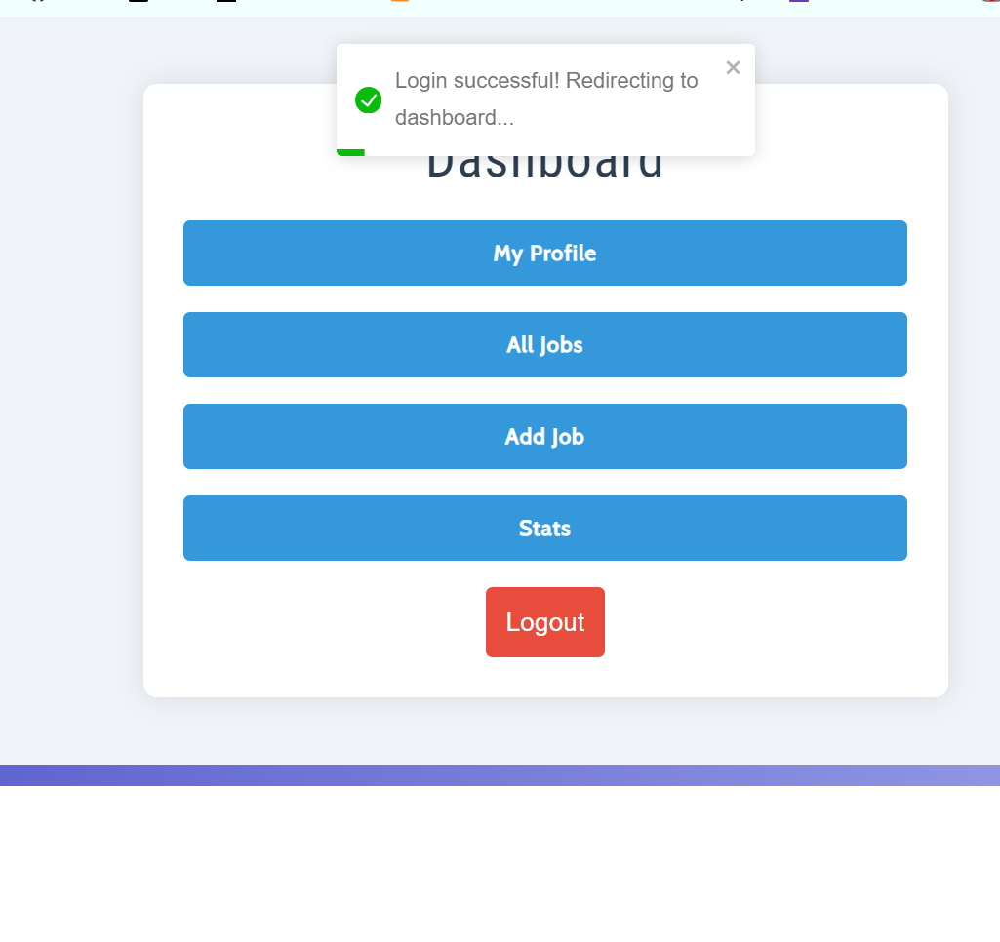
- 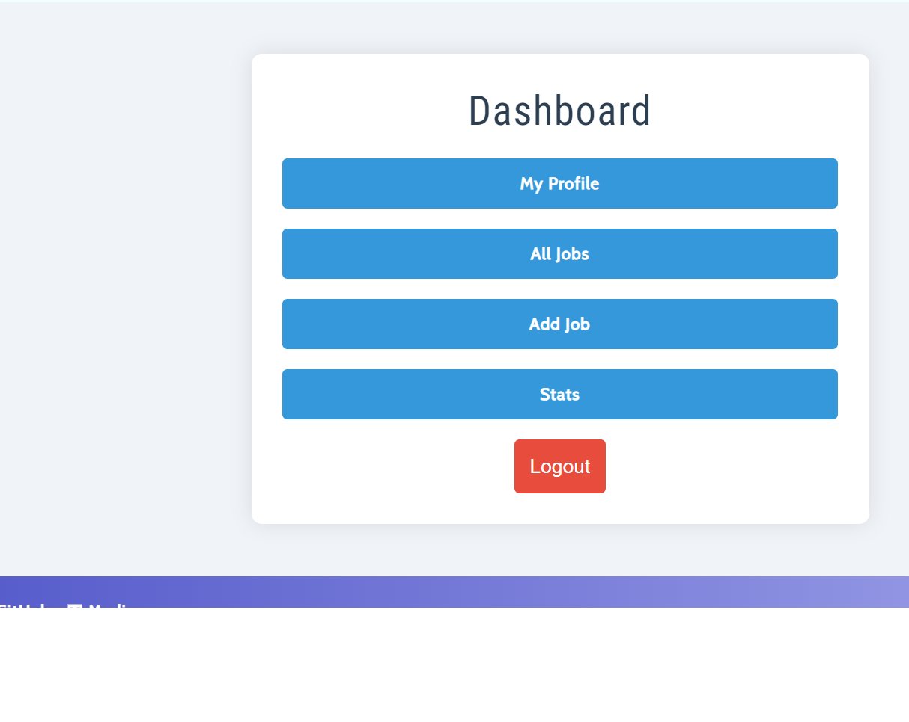
- 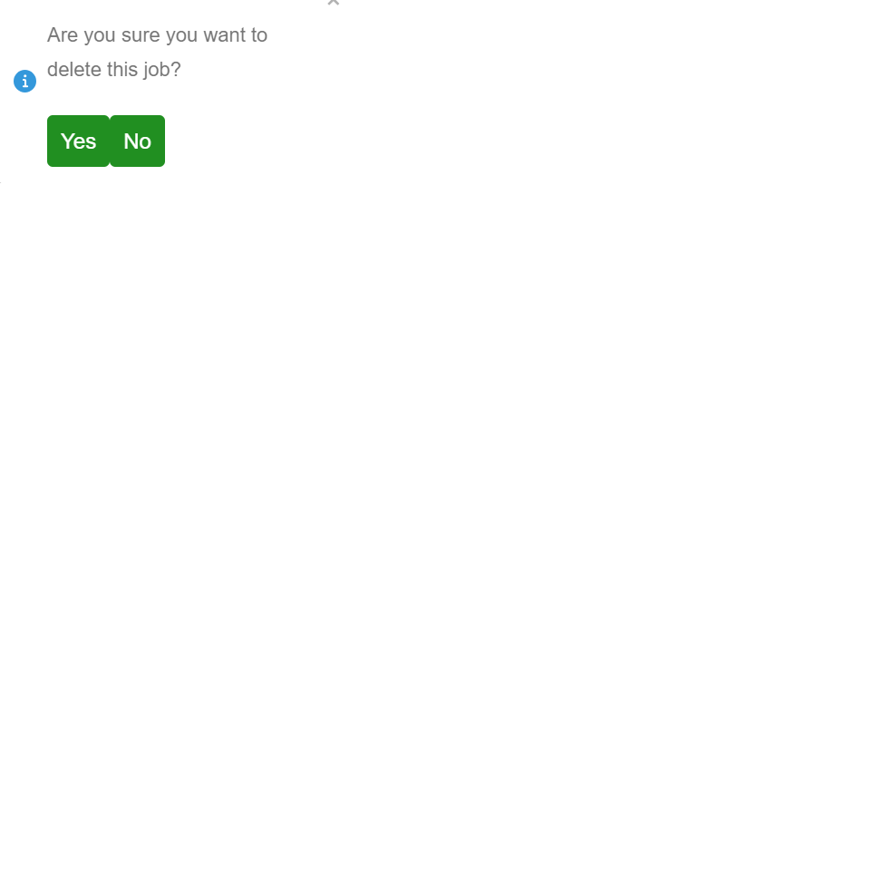
- 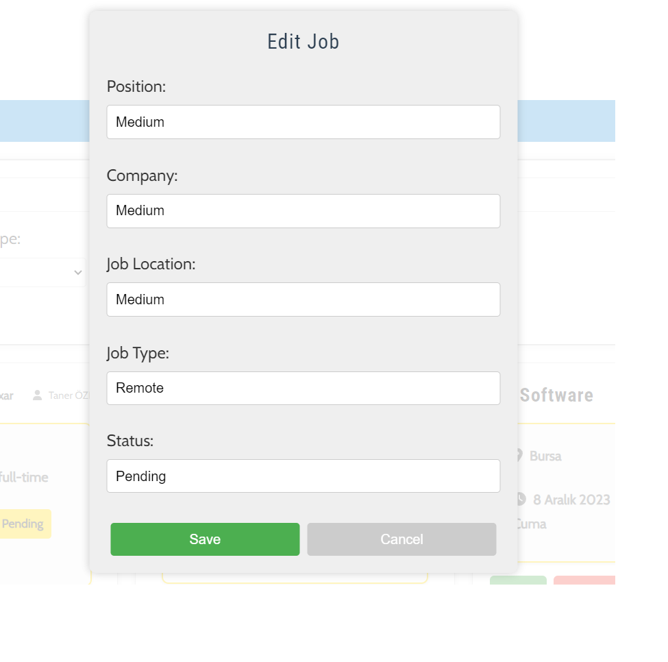
- 
- 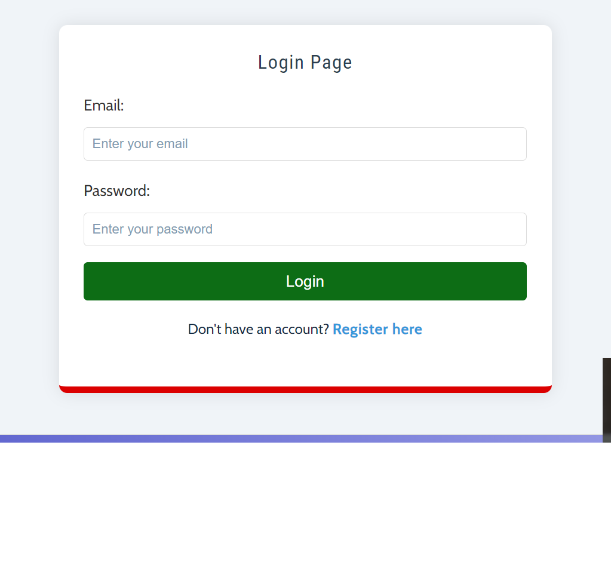
- 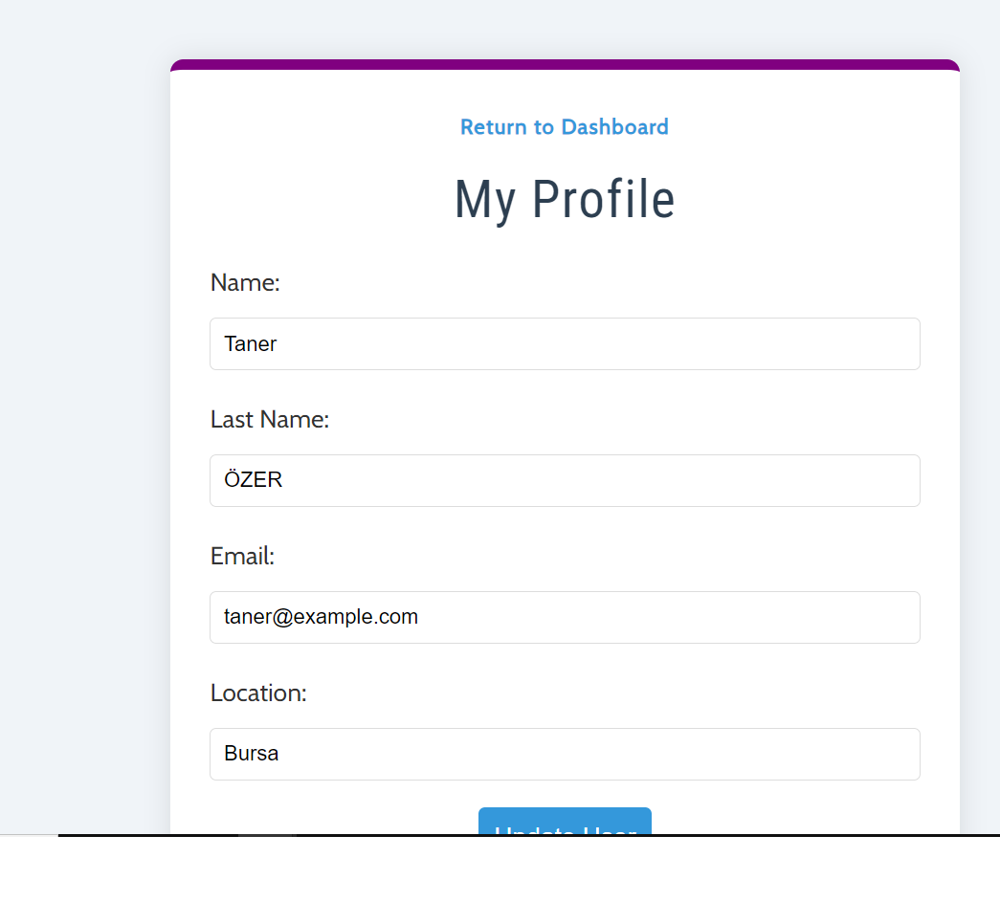

Authentication Routes
---------------------

Endpoint

Description

Rate Limit

`POST /api/v1/auth/register`

Register a new user.

10 requests per 15 minutes per IP.

`POST /api/v1/auth/login`

Authenticate user credentials and receive a token.

10 requests per 15 minutes per IP.

`GET /api/v1/auth/logout`

Log out the currently authenticated user.

N/A

`PATCH /api/v1/auth/updateUser/:id`

Update the profile information of a user.

Authentication Required

`GET /api/v1/auth/getCurrentUser`

Fetch details of the currently authenticated user.

Authentication Required

Job Listings Routes
-------------------

Endpoint

Description

Authentication Required

`POST /api/v1/jobs/`

Create a new job listing.

Yes

`GET /api/v1/jobs/`

Fetch all job listings.

No

`GET /api/v1/jobs/stats`

Fetch statistics related to job listings.

No

`GET /api/v1/jobs/:id`

Fetch a job listing by its ID.

No

`PATCH /api/v1/jobs/:id`

Update a job listing by its ID.

Yes

`DELETE /api/v1/jobs/:id`

Delete a job listing by its ID.

Yes

Rate Limiting
-------------

Rate limiting is implemented on the authentication routes with a limit of `10 requests per 15 minutes per IP address`.

Authentication
--------------

To access routes that require authentication, you must include a valid JWT token in the request headers. The token can be obtained by logging in.

Security
--------

*   Cross-Origin Resource Sharing (CORS) is enabled with credentials support.
*   Various security middlewares like `helmet`, `xss-clean`, and `express-mongo-sanitize` are implemented to enhance application security.

Technologies Used
-----------------

*   Node.js
*   Express.js
*   MongoDB
*   JWT for authentication
*   Rate limiting with express-rate-limit

Contributing
------------

Pull requests are welcome. For major changes, please open an issue first to discuss what you would like to change.

License
-------

This project is licensed under the MIT License.
